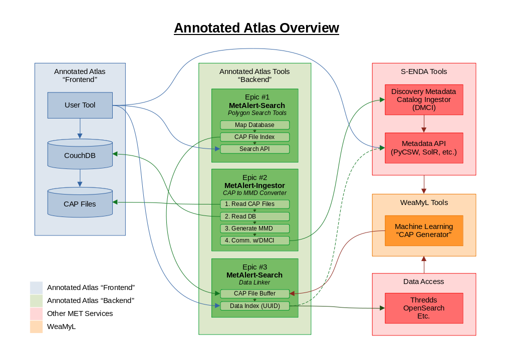

# Annotated Atlas

This is the repository for documentation and project management for the Annotated Atlas software
components.

## Related Repositories

### MetAlert Search

Repository: https://github.com/metno/MetAlert-Search

The MetAlert Search component is a search and indexing tool for CAP files. The tool is designed to
run as a REST API on Kubernetes. The package is written for Python 3.6+ and uses Flask for the API
component.

The main purpose of this component is to make it possible to search through an archive of CAP files
using geographic polygons. The polygon feature is implemented using the Shapely package.

### MetAlert Ingestor

Repository: https://github.com/metno/MetAlert-Ingestor

## Overview

Below is an overview diagram of the Annotated Atlas components as they are intended to connect to
other services. The diagram is also available as an
[Open Document Draw file](assets/annatlas_overview.odg) and as [PDF](assets/annatlas_overview.pdf).

